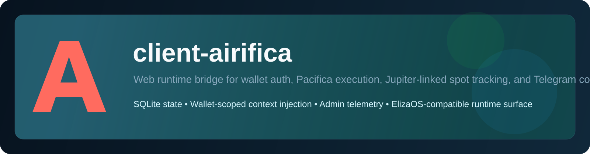

# client-airifica

<p align="center">
  
</p>

<p align="center">
  <strong>Authenticated runtime bridge for the Airifica web product.</strong><br/>
  Wallet-auth sessions · Pacifica execution · Jupiter spot handoff · Telegram linking · Admin telemetry
</p>

<p align="center">
  
  
  
  
  
  
  
</p>

## Overview

`client-airifica` is the server-side package that powers the Airifica web product inside an ElizaOS runtime.

It owns the trusted boundary between browser sessions and trading infrastructure:

- Solana wallet challenge / verify auth
- per-wallet session creation and conversation routing
- live market context and venue resolution
- Pacifica onboarding, overview, order execution, and close flows
- Jupiter-linked spot tracking and lifecycle notifications
- Telegram linking, internal bot APIs, alert delivery, and runtime analytics
- admin overview and runtime telemetry endpoints

The repository is branded `client-airifica`, but the live compatibility contract intentionally stays on the legacy `airi3` namespace:

- HTTP routes remain under `/api/airi3/*`
- env compatibility still accepts `AIRI3_*`
- the Eliza client id remains `airi3`

That lets the package drop into the current Airifica stack without forcing a route migration in the web frontend.

## Features

| Area | What it does |
|---|---|
| Wallet auth | Challenge / verify flow for Solana wallets, signed session tokens, wallet-scoped access |
| Conversation runtime | Routes web and Telegram messages into the active Eliza runtime with per-wallet state injection |
| Market context | Pacifica universe lookup plus fallback market discovery for non-Pacifica assets |
| Pacifica execution | Builder approval, agent wallet binding, overview, open positions, market open/close |
| Spot lifecycle | Tracks onchain spot holdings and Jupiter-originated execution state per wallet |
| Telegram product flow | Link codes, deep links, alerts, action menus, positions, history, and proposal handoff |
| Admin telemetry | Runtime health, env/config visibility, request analytics, user counts, and control-panel data |
| Persistence | Uses the same SQLite runtime database as ElizaOS with Airifica-specific tables |

## Architecture

```text
Browser / Telegram
       │
       ▼
client-airifica
  ├── Auth boundary
  │    ├── /api/auth/challenge
  │    └── /api/auth/verify
  ├── Conversation API
  │    ├── /api/airi3/session
  │    ├── /api/airi3/message
  │    └── /api/airi3/history
  ├── Market / execution API
  │    ├── /api/airi3/market-context
  │    ├── /api/airi3/market-universe
  │    ├── /api/airi3/proposals/*
  │    └── /api/airi3/pacifica/*
  ├── Telegram internal surface
  │    ├── link / notify / status
  │    ├── positions / history / analytics
  │    └── runtime heartbeat
  ├── Admin surface
  │    └── /api/airi3/admin/*
  └── SQLite state store
       ├── wallet bindings
       ├── trade ledger
       ├── onchain spot snapshots
       ├── telegram links
       └── runtime analytics
```

## Project Structure

```text
client-airifica/
├── src/
│   ├── airificaClient.ts
│   ├── auth.ts
│   ├── index.ts
│   ├── market-context.ts
│   ├── messageManager.ts
│   ├── pacifica.ts
│   ├── server.ts
│   ├── state.ts
│   └── types.ts
├── docs/
│   ├── architecture.md
│   ├── configuration.md
│   ├── elizaos-integration.md
│   ├── operations.md
│   ├── pacifica.md
│   └── media/
├── .env.example
├── package.json
├── tsconfig.json
└── tsup.config.ts
```

## Requirements

- Node.js `23.x`
- `pnpm`
- an ElizaOS runtime using `@elizaos/core`
- SQLite available through the host runtime
- Pacifica builder access for perp execution
- a Solana RPC endpoint for onchain portfolio sync

## Quick Start

```bash
git clone git@github.com:0xfunboy/client-airifica.git
cd client-airifica
pnpm install
cp .env.example .env
pnpm build
```

This repository is the package only. It is typically consumed from an ElizaOS runtime, not launched as a standalone app shell.

## Core Runtime Surface

High-signal routes exposed by the package:

- `GET /api/airi3/health`
- `POST /api/auth/challenge`
- `POST /api/auth/verify`
- `POST /api/airi3/session`
- `POST /api/airi3/message`
- `GET /api/airi3/history`
- `GET /api/airi3/market-context`
- `GET /api/airi3/market-universe`
- `POST /api/airi3/proposals/:id/approve`
- `GET /api/airi3/pacifica/overview`
- `POST /api/airi3/pacifica/positions/close`
- `GET /api/airi3/admin/overview`
- `POST /api/airi3/telegram/link/code`
- `GET /api/airi3/telegram/link/status`

## Security Model

- wallet context is injected per wallet instance, never globally
- Telegram context is injected only for the linked wallet of that chat
- agent wallet keys remain encrypted at rest
- admin access is gated by wallet allowlist and signed session auth
- production startup refuses permissive CORS unless explicitly configured

## Documentation

| Document | Description |
|---|---|
| [Configuration](docs/configuration.md) | Full env reference, compatibility notes, production baselines |
| [Architecture](docs/architecture.md) | Runtime layout, data boundaries, request flows, persistence model |
| [Pacifica & Spot Execution](docs/pacifica.md) | Pacifica onboarding, Jupiter-linked spot tracking, ledger behavior |
| [ElizaOS Integration](docs/elizaos-integration.md) | How to wire the package into an ElizaOS workspace |
| [Operations](docs/operations.md) | Build, restart, troubleshooting, and deployment notes |

## License

MIT
